# O2 Analyzer Firmware

PlatformIO firmware for an Arduino-based nitrox / oxygen analyzer with a 128x64 SSD1306 OLED, ADS1115 ADC, buzzer feedback, EEPROM-backed calibration, and a single-button UI. The code is originally based on [Eunjae Im's OLED nitrox analyzer project](http://ejlabs.net/arduino-oled-nitrox-analyzer). 

This firmware accompanies the Divetech nitrox analyzer enclosure designed by Tony Land and is intended to build cleanly in Visual Studio Code with current PlatformIO and Adafruit libraries.

## Images

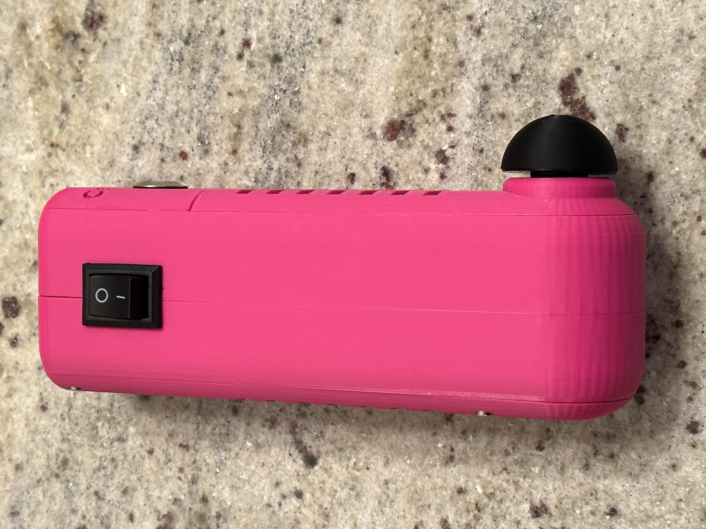

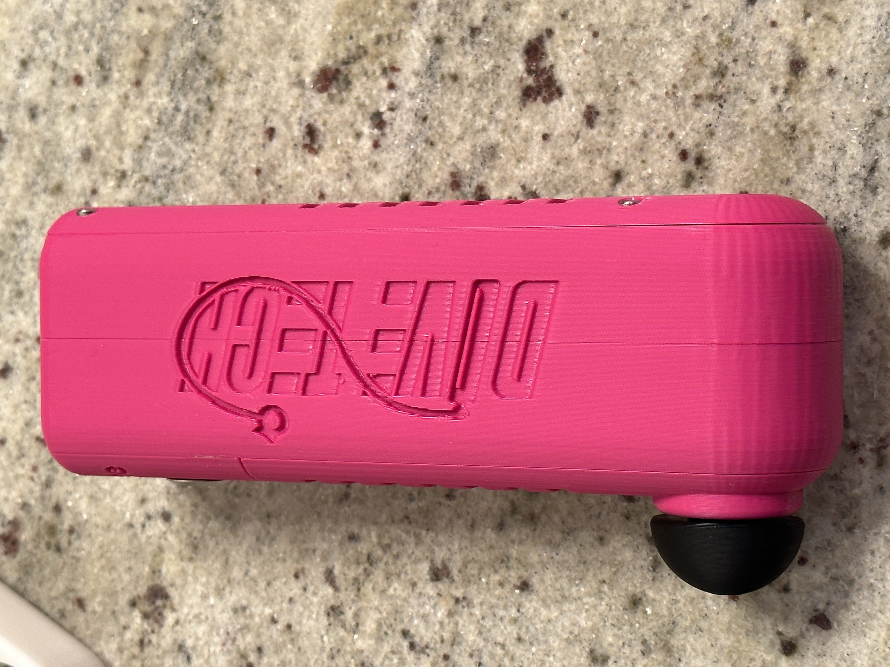

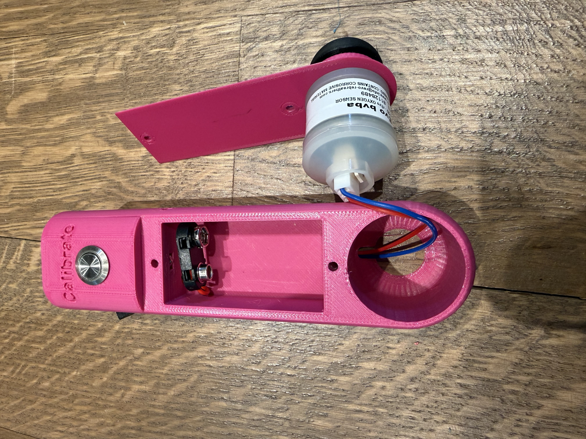

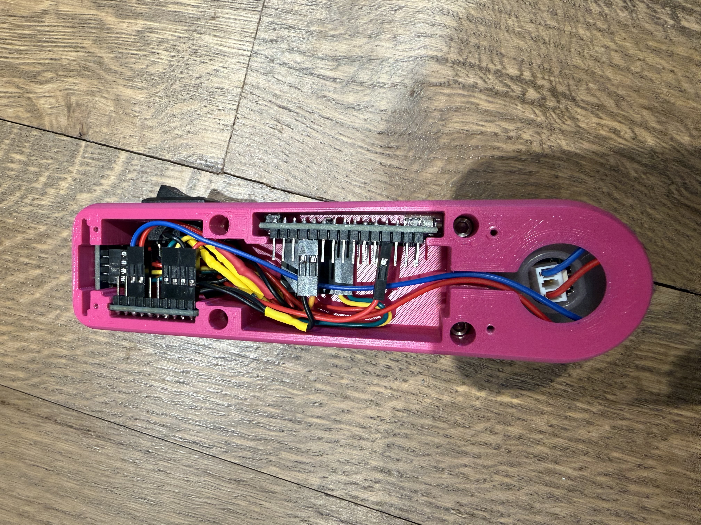

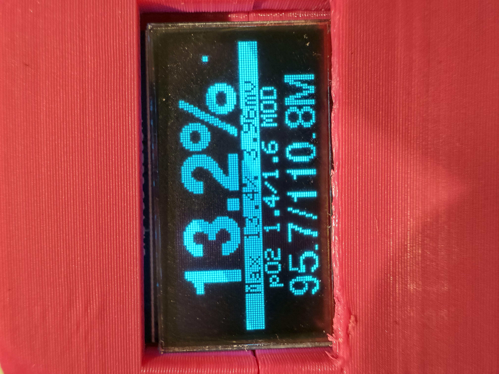

## OLED Screenshots

| 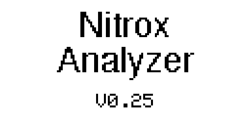 | 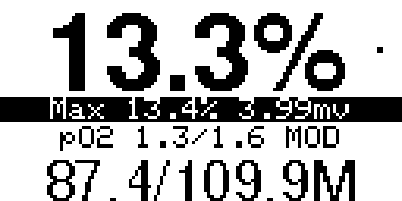 | 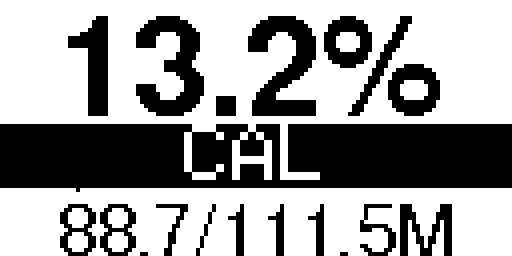 |  |
| --- | --- | --- | --- |
| 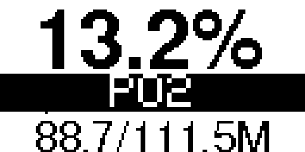 | 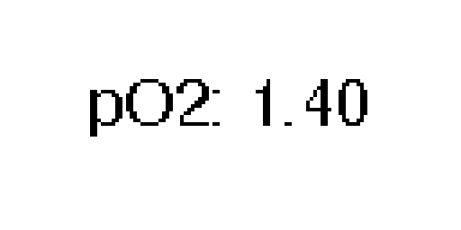 | 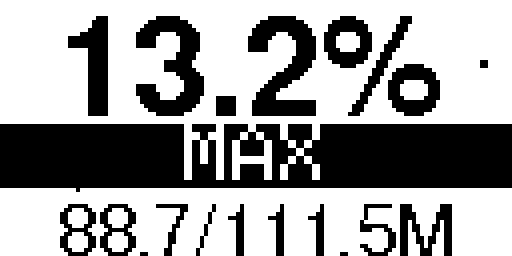 | 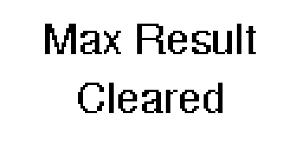 |

The current project target is an Arduino Nano ATmega328P with the new bootloader configuration.

## Features

- Reads the oxygen sensor through an ADS1115 differential input
- Smooths sensor readings with a lightweight local moving average
- Displays live O2 percentage, max reading, sensor millivolts, and MOD values
- Stores calibration data in EEPROM so it survives power cycles
- Uses a single button hold-menu for lock, calibration, pO2 selection, buzzer toggle, MOD unit toggle, and max-clear actions
- Uses centered OLED layouts and subsetted Adafruit GFX fonts to preserve the condensed UI while reducing flash usage
- Skips redundant OLED redraws to reduce display flicker and unnecessary work

## Hardware

- Arduino Nano ATmega328P (new bootloader)
- SSD1306 OLED display, 128x64, I2C, address `0x3C`
- ADS1115 ADC
- Oxygen sensor wired to ADS1115 differential input `A0/A1`
- Push button on digital pin `2`
- Buzzer on digital pin `3`

## Wiring Diagram

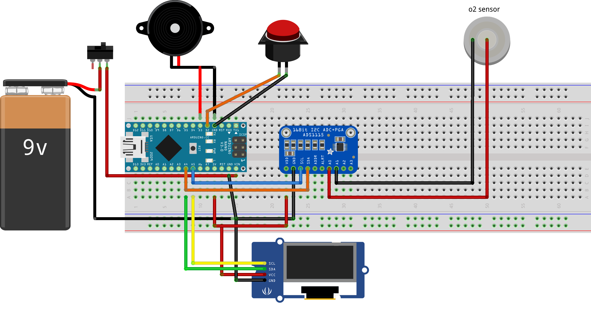

Connection details, based on the original wiring notes:

- ADS1115: `VDD` to `5V`, `GND` to `GND`, `SCL` to `A5`, `SDA` to `A4`
- OLED display: `VCC` to `5V`, `GND` to `GND`, `SCL` to `A5`, `SDA` to `A4`
- Push button: one side to `GND`, the other to `D2`
- Buzzer: positive to `D3`, negative to `GND`
- Oxygen sensor: positive to ADS1115 `A0`, negative to ADS1115 `A1`
- Battery: positive to `VIN` through the rocker switch, negative to `GND`

The OLED and ADS1115 share the same I2C bus, so both modules connect to the Nano's `A4`/`SDA` and `A5`/`SCL` pins.

The original ejlabs notes also caution that a `9V` battery is a poor long-term power choice for Arduino projects and that reverse polarity on `VIN` can damage the onboard regulator.

## Enclosure And 3D Files

The printable enclosure is based on [Tony Land's Divetech nitrox analyzer housing](https://web.archive.org/web/20240414033725/https://www.divetech.com/post/the-20-nitrox-analyzer) and was remixed to fit commonly available `0.96"` `128x64` OLED modules whose display glass is larger than the original front-panel cutout.

The STL files are available from:

- GitHub: [hardware/3d-models](hardware/3d-models)
- Printables: [Divetech nitrox analyzer enclosure](https://www.printables.com/model/554448-oled-modification-for-divetech-nitrox-analyzer)

Assembly Photos:

- [hardware/assembly/README.md](hardware/assembly/README.md)

## Bill Of Materials

The Printables model lists these materials for the physical build, with example source links for several parts:

- [Arduino Nano](https://a.co/d/hmOA4fG)
- [`.96 inch` `128x64` OLED screen](https://a.co/d/fV3mk5q)
- [ADS1115 analog-to-digital converter](https://a.co/d/guoRf2Z)
- [Rocker switch](https://a.co/d/8EYTpxj), `13 x 19 mm` panel mount
- [Push button](https://a.co/d/2yPEBGB), `12 mm` diameter
- [`9 mm` electronic buzzer](https://a.co/d/0gzqU7lq)
- `6` M3x10 mm hex-head screws
- `4` M2x10 mm hex-head screws
- Molex terminals
- [`9V` battery clip connector](https://a.co/d/7T9FWCe)
- `9V` battery
- O2 sensor (with Molex 3-Pin Connector)
- Wire and solder

## Button Actions

- Tap: lock screen
- Hold for the menu-entry delay: enter the hold menu at `CAL`
- Keep holding: cycle through `CAL` -> `PO2` -> `BUZ` -> `MOD` -> `MAX` -> normal screen, then repeat
- Release while a menu label is shown: run that action
- Release while the normal screen is shown during the cycle: exit without changing anything

## Project Layout

```text
o2-analyzer/
├── .gitignore
├── hardware/
│   ├── 3d-models/
│   │   ├── back_cap.stl
│   │   ├── back_half.stl
│   │   ├── battery-sensor_cover.stl
│   │   ├── flow_restrictor.stl
│   │   ├── flow_restrictor_10mm.stl
│   │   ├── flow_restrictor_115mm.stl
│   │   ├── flow_restrictor_12mm.stl
│   │   ├── flow_restrictor_95mm.stl
│   │   ├── flow_restrictor_9mm.stl
│   │   ├── front_half_v2.stl
│   │   └── front_upper_cover.stl
│   └── assembly/
│       ├── assembly-[1-7].jpg
│       ├── assembly-8.png
│       └── README.md
├── images/
│   ├── nitrox_analyzer-[1-5].jpeg
│   ├── oled-arduino-nitrox-analyzer.png
│   └── oled_screenshot_[1-8].png
├── include/
│   ├── display_ui.h
│   ├── FreeSans9pt7bSubset.h
│   ├── FreeSansBold18pt7bSubset.h
│   └── settings.h
├── LICENSE
├── platformio.ini
├── README.md
├── src/
│   ├── display_ui.cpp
│   └── main.cpp
└── tools/
    └── oled_capture.py
```

- [src/display_ui.cpp](src/display_ui.cpp): OLED rendering and text/layout helpers
- [include/display_ui.h](include/display_ui.h): display snapshot model and rendering function declarations
- [src/main.cpp](src/main.cpp): firmware logic, UI rendering, button handling, calibration, and sensor processing
- [include/FreeSans9pt7bSubset.h](include/FreeSans9pt7bSubset.h): subset small UI font
- [include/FreeSansBold18pt7bSubset.h](include/FreeSansBold18pt7bSubset.h): subset large percentage font
- [include/settings.h](include/settings.h): firmware configuration constants for pins, timings, display settings, and calibration defaults
- [.gitignore](.gitignore): ignores PlatformIO build outputs, editor settings, and macOS metadata
- [hardware/assembly/README.md](hardware/assembly/README.md): assembly image gallery
- [hardware/3d-models](hardware/3d-models): printable enclosure and accessory STL files
- [platformio.ini](platformio.ini): PlatformIO target, libraries, and build flags
- [tools/oled_capture.py](tools/oled_capture.py): converts a captured SSD1306 framebuffer dump into a PNG image

## Build Configuration

Current PlatformIO configuration:

```ini
[platformio]
default_envs = nano

[env]
framework = arduino
monitor_speed = 9600
upload_speed = 115200
build_flags =
  -D SSD1306_NO_SPLASH
  -D SERIAL_RX_BUFFER_SIZE=16
  -D SERIAL_TX_BUFFER_SIZE=16
lib_deps =
  adafruit/Adafruit GFX Library @ ^1.12.6
  adafruit/Adafruit SSD1306 @ ^2.5.16
  adafruit/Adafruit ADS1X15 @ ^2.6.2

[env:nano]
platform = atmelavr
board = nanoatmega328new
```

Install PlatformIO with either the VS Code PlatformIO extension or the CLI:

```sh
python3 -m pip install --user platformio
```

## Visual Studio Code Setup

To clone and build this firmware from Visual Studio Code:

1. Install [Visual Studio Code](https://code.visualstudio.com/).
2. Install the following extensions from the VS Code marketplace:
  - [PlatformIO IDE](https://marketplace.visualstudio.com/items?itemName=platformio.platformio-ide) for dependency management, building, uploading, and serial monitoring.
  - [C/C++](https://marketplace.visualstudio.com/items?itemName=ms-vscode.cpptools) for code navigation and IntelliSense.
3. Ensure `git` is installed on your machine.
4. Open the VS Code Command Palette and run `Git: Clone`.
5. Paste the repository URL and choose a local folder.
6. Open the cloned `o2-analyzer` folder in VS Code.
7. Wait for PlatformIO to finish initializing the project and installing toolchains and libraries.

You can also clone from a terminal:

```sh
git clone https://github.com/kedube/o2-analyzer.git
cd o2-analyzer
code .
```

### Build In VS Code

After the folder is open in VS Code:

1. Click the PlatformIO alien-head icon in the Activity Bar.
2. Under `PROJECT TASKS` > `nano`, run `Build`.
3. Connect the Arduino Nano over USB.
4. Run `Upload` to flash the firmware.
5. Run `Monitor` to open the serial console at `9600` baud.

PlatformIO uses the default `nano` environment defined in [platformio.ini](platformio.ini).

## Configuration Options

This project has two main configuration layers: PlatformIO project settings in [platformio.ini](platformio.ini) and firmware settings in [include/settings.h](include/settings.h).

### PlatformIO Options

Common options you may want to change in [platformio.ini](platformio.ini):

- `default_envs`: selects the default build target. The current default is `nano`.
- `board`: selects the Arduino board definition. The current board is `nanoatmega328new`.
- `monitor_speed`: sets the serial monitor baud rate. The firmware uses `9600`.
- `upload_speed`: sets the upload baud rate. The current value is `115200`.
- `upload_port`: optional manual serial port override if auto-detection fails.
- `build_flags`: compile-time defines passed to the build. `SSD1306_NO_SPLASH` is enabled to save flash.
- `SERIAL_RX_BUFFER_SIZE` and `SERIAL_TX_BUFFER_SIZE`: reduced to `16` bytes to preserve SRAM for the SSD1306 framebuffer on the ATmega328P.
- `lib_deps`: PlatformIO-managed library dependencies.

Example manual serial port configuration:

```ini
[env:nano]
platform = atmelavr
board = nanoatmega328new
upload_port = /dev/tty.usbserial-0001
```

### Firmware Options

Hardware and behavior settings are defined in [include/settings.h](include/settings.h). After changing these values, rebuild and upload the firmware.

- `kScreenAddress`: I2C address for the SSD1306 display. Default: `0x3C`.
- `kButtonPin`: button input pin. Default: `2`.
- `kBuzzerPin`: buzzer output pin. Default: `3`.
- `kBuzzerEnabledByDefault`: sets whether the buzzer starts enabled after boot. Default: `true`.
- `kBootDebugLogging`: enables verbose startup logging over serial for boot diagnostics. Default: `false`.
- `kModInFeetByDefault`: sets whether MOD values default to feet instead of meters. Default: `true`.
- `kSerialBaudRate`: serial monitor and screenshot capture baud rate. Default: `9600`.
- `kScreenshotCommand`: serial command character used to request a display dump. Default: `s`.
- `kOledReset`: OLED reset pin passed to the display driver. Default: `4`.
- `kRaSize`: moving-average sample window for sensor smoothing. Default: `20`.
- `kMenuEntryHoldSeconds`: button hold time before the menu appears. Default: `2` seconds.
- `kMenuStepIntervalMs`: time each menu slot stays active before advancing to the next label or back to the normal screen. Default: `1100` ms.
- `kStatusScreenMs`: how long temporary status screens remain visible. Default: `1200` ms.
- `kLockScreenMs`: lock-screen display duration. Default: `5000` ms.
- `kAirCalibrationPercent`: oxygen percentage used for air calibration. Default: `20.9`.
- `kDefaultMinPo2`: default selected working pO2 at startup. Default: `1.40`.
- `kDefaultMaxPo2`: default maximum pO2 used in MOD calculations. Default: `1.60`.
- `kMinValidCalibration` and `kMaxValidCalibration`: accepted calibration range guardrails.

Change these only if your hardware wiring, display address, or operating assumptions differ from the current build.

## Build

From the repository root:

```sh
platformio run
```

## Upload

```sh
platformio run --target upload
```

If PlatformIO does not auto-detect the serial port on your machine, add `upload_port` to [platformio.ini](platformio.ini).

## Serial Monitor

```sh
platformio device monitor --baud 9600
```

## Display Screenshot Utility

The repository includes [tools/oled_capture.py](tools/oled_capture.py), a small host-side utility that converts a `128x64` Adafruit SSD1306 framebuffer dump into a PNG.

It accepts any of these inputs:

- A raw `1024`-byte framebuffer file in Adafruit SSD1306 page order.
- An ASCII hex dump containing the same `1024` bytes.
- A serial frame with the header `OLED_FRAME 128 64` followed by `1024` raw bytes.

The firmware supports live screenshot capture over USB serial. It listens at `9600` baud and sends the current OLED framebuffer when it receives the `s` command.

Convert a saved raw framebuffer dump into a PNG:

```sh
python3 tools/oled_capture.py oled-frame.bin --output oled-screenshot.png
```

Convert a hex dump into a larger image:

```sh
python3 tools/oled_capture.py oled-frame.txt --format hex --scale 6 --output oled-screenshot.png
```

Capture a live screenshot directly from the analyzer:

```sh
python3 -m pip install pyserial
python3 tools/oled_capture.py --serial /dev/tty.usbserial-0001 --output oled-screenshot.png
```

The script sends `s` automatically before waiting for the frame. If you change the firmware command character, pass the new value with `--command`.

## Dependencies

PlatformIO installs these libraries automatically:

- Adafruit GFX Library
- Adafruit SSD1306
- Adafruit ADS1X15

Core Arduino libraries used directly by the firmware:

- Wire
- EEPROM

## Calibration Notes

- Calibration is based on ambient air and uses `20.9%` oxygen as the reference point.
- Calibration is stored in EEPROM with a validation marker.
- If saved calibration data is missing or invalid, the firmware forces a new calibration during startup.
- The firmware constrains calibration input to a sane range before saving it.

## Firmware Notes

- The splash bitmap in Adafruit SSD1306 is disabled at build time to save flash.
- The small and large UI fonts are subsetted to only the glyphs used by the analyzer screens.
- Display updates are cached so unchanged frames are not redrawn.
- Current builds are comfortably within ATmega328P limits.

## Origin

This project sits on top of earlier mechanical and firmware work:

- The enclosure remix is based on Tony Land's Divetech nitrox analyzer housing.
- The firmware originates from Eunjae Im's OLED nitrox analyzer project and has been updated here for current OLED hardware, newer Adafruit libraries, and a smoother VS Code and PlatformIO workflow.
- The Printables project page for this build is [OLED modification for Divetech nitrox analyzer](https://www.printables.com/model/554448-oled-modification-for-divetech-nitrox-analyzer).

Background references:

- http://ejlabs.net/arduino-oled-nitrox-analyzer
- https://web.archive.org/web/20240414033725/https://www.divetech.com/post/the-20-nitrox-analyzer

## License

Licensed under GNU GPL v3. See [LICENSE](LICENSE).
